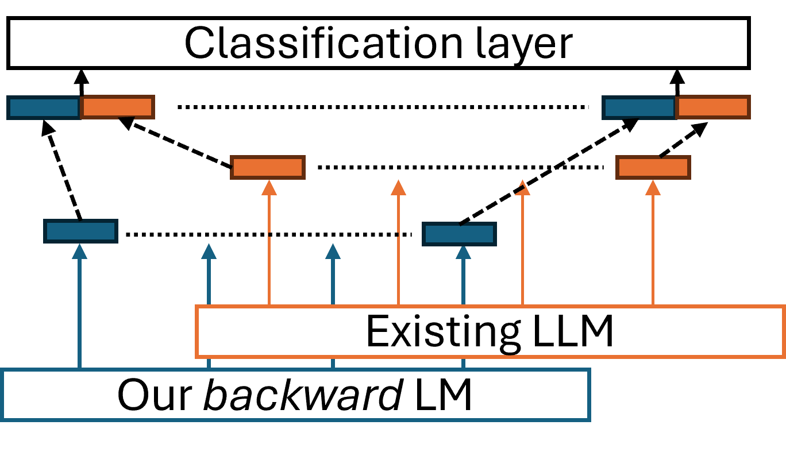
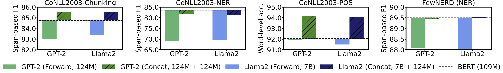

# backward_llm: Acquiring Bidirectionality via Large and Small Language Models

This repository implements LLM for obtaining token-level representations as proposed in our COLING 2025 paper "[Acquiring Bidirectionality via Large and Small Language Models](https://www.arxiv.org/abs/2408.09640)."
Using token representation from bidirectional language models (LMs) such as BERT is still a widely used approach for token-classification tasks.
Even though there exist much larger unidirectional LMs such as Llama-2, they are rarely used to replace the token representation of bidirectional LMs.
In this work, we hypothesize that their lack of bidirectionality is what is keeping unidirectional LMs behind.
To that end, we propose to newly train a small backward LM and concatenate its representations to those of an existing LM  for downstream tasks.



Through experiments in token-classification tasks, we demonstrate that introducing a backward model can improve the benchmark performance by more than 10 points.



For more details, please refer to our [paper](https://www.arxiv.org/abs/2408.09640).

## Installation

```bash
pip install git+https://github.com/hitachi-nlp/backward-llm.git
```

Alternatively, you can install it under "edit mode" for development and experiments.

```bash
git clone https://github.com/hitachi-nlp/backward-llm.git
cd backward-llm
pip install -e ./
```

## Usage

```python
import torch
from transformers import AutoTokenizer

from backward_llm import ConcatLMConfig, ConcatLMModel, ReversedTokenizer

config = ConcatLMConfig(
    name_or_path_forward="openai-community/gpt2",
    name_or_path_backward="hitachi-nlp/backward-llm-gpt2-vocab",
)
model = ConcatLMModel(config)

sents = ["This is a sample sentence ."]
tokenizer = AutoTokenizer.from_pretrained("openai-community/gpt2")
# It will reverse the tokenizer internally, so it should NOT be hitachi-nlp/backward-llm-gpt2-vocab
r_tokenizer = ReversedTokenizer.from_pretrained("openai-community/gpt2")
encode = tokenizer(sents, return_tensors="pt")
r_encode = r_tokenizer(sents, return_tensors="pt")
output = model(
    input_ids=encode["input_ids"],
    attention_mask=encode["attention_mask"],
    input_ids_backward=r_encode["input_ids"],
)
assert output.concat_logits.shape == torch.Size([1, 6, 768 * 2])
```

We also provide the extension models for the token classiciation tasks.

```python
import torch
from transformers import AutoTokenizer
from transformers.modeling_outputs import TokenClassifierOutput

from backward_llm import (
    ConcatLMConfig,
    ConcatLMForTokenClassification,
    ReversedTokenizer,
)

config = ConcatLMConfig(
    name_or_path_forward="openai-community/gpt2",
    name_or_path_backward="hitachi-nlp/backward-llm-gpt2-vocab",
    id2label={0: "label_1", 1: "label_2"},
    label2id={"label_1": 0, "label_2": 1},
    max_length=128,
    dropout=0.1,
)
model = ConcatLMForTokenClassification(config)
sents = ["This is a sample sentence ."]

# Token-level labels
labels = [[0, 0, 0, 1, 1, 1]]
tokenizer = AutoTokenizer.from_pretrained("openai-community/gpt2")
# It will reverse the tokenizer internally, so it should NOT be hitachi-nlp/backward-llm-gpt2-vocab
r_tokenizer = ReversedTokenizer.from_pretrained("openai-community/gpt2")

encode = tokenizer(sents, return_tensors="pt")
r_encode = r_tokenizer(sents, return_tensors="pt")

output: TokenClassifierOutput = model(
    input_ids=encode["input_ids"],
    attention_mask=encode["attention_mask"],
    input_ids_backward=r_encode["input_ids"],
    labels=torch.tensor(labels),
)

# When training
output.loss.backward()
# When inferencing
pred_labels = torch.argmax(output.logits, dim=-1)
```

We've uploaded two backward models ourselves:

| Model ID | Vocab | #parameters | URL |
|----------|-------|-------------|-----|
| `hitachi-nlp/backward-llm-llama2-vocab` | [`meta-llama/Llama-2-7b-hf`](https://huggingface.co/meta-llama/Llama-2-7b-hf) | 124M |  https://huggingface.co/hitachi-nlp/backward-llm-llama2-vocab |
| `hitachi-nlp/backward-llm-gpt2-vocab` | [`openai-community/gpt2`](https://huggingface.co/openai-community/gpt2) | 124M | https://huggingface.co/hitachi-nlp/backward-llm-gpt2-vocab |


## Reproduction of the experiments

- [experiments/train_backward](./experiments/train_backward/)
Code for training a backward model.

- [experiments/downstream](./experiments/downstream/)
Code for training of token-classification tasks.

## Development

```bash
pip install -e '.[dev]'
```

### Testing

Run

```bash
pytest
```

### Implementation note on reversed tokenizer

We implement reversed tokenizer to make inputs for a backward model.

```python
tok_args = {
    "text": ["this is a sample.", "short sentence"],
    "return_tensors": "pt",
    "padding": True,
}

# When using original tokenizer
from transformers import AutoTokenizer

tokenizer = AutoTokenizer.from_pretrained("openai-community/gpt2")
tokenizer.pad_token = tokenizer.eos_token
encode = tokenizer(**tok_args)
print(encode)
"""
{'input_ids': tensor([[ 5661,   318,   257,  6291,    13],
                      [19509,  6827, 50256, 50256, 50256]]),
'attention_mask': tensor([[1, 1, 1, 1, 1],
                          [1, 1, 0, 0, 0]])}
"""

# When using our reversed tokenizer
from backward_llm import ReversedTokenizer

r_tokenizer = ReversedTokenizer("openai-community/gpt2")
encode = r_tokenizer(**tok_args)
print(encode)

"""
{'input_ids': tensor([[   13,  6291,   257,   318,  5661],
                      [ 6827, 19509, 50256, 50256, 50256]]),
'attention_mask': tensor([[1, 1, 1, 1, 1],
                          [1, 1, 0, 0, 0]])}
"""
```

## Citation

```bib
@inproceedings{takumi-goto-2025-acuquiring,
    title = "Acquiring Bidirectionality via Large and Small Language Models",
    author = "Goto, Takumi and
      Nagao, Hiroyoshi and
      Koreeda, Yuta",
    booktitle = "Proceedings of the 31st International Conference on Computational Linguistics (COLING2025)",
    year = "2025",
    url = "https://www.arxiv.org/abs/2408.09640",
}
```
